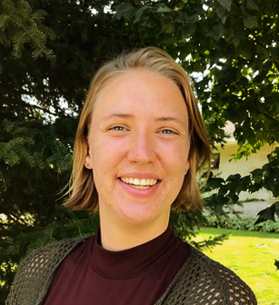

# About Me

I am a developing scientist and a software engineer aiming to advance our understanding and response to global climate problems. My background is working with geospatial data at scale, with a particular focus on satellite data which I gained at Maxar and at a variety of NASA engagements. My time at Development Seed built a lasting belief in the power of Open Source Software and Open Science through collaborations with NASA and the Pangeo community. User engagement and collaborative practices are core to my problem solving style. I am currently working on a Masters degree in Atmospheric and Oceanic Science at the University of Maryland where I continue to blend and grow my skills in science and software while working on cross-organizational applied science.

# Curriculum Vitae
[Download](./assets/Wegener_CV.pdf)

# Get in touch
**Email:** rwegener@umd.edu -- 
**Github:** [rwegener2](https://github.com/rwegener2) -- 
**Twitter:** [@rwegener2](https://twitter.com/rwegener2) -- 
**[LinkedIn](https://www.linkedin.com/in/rachelwegener/)**
