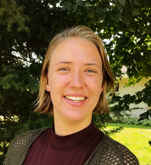

# About Me

I am an open-source first software engineer with over 5 years of experience making data meaningful for people. I have worked on data pipelines for NASA and contributed to open source projects. Trained as a climate scientist, I have substantial expertise in the nuances of actionable earth science data for scientists and citizens. I typically build on the cloud ☁️.

I believe that any successful project is built on both technical infrastructure and human infrastructure, and each is a different type of puzzle to navigate. As a data engineer I have handled terabytes of satellite imagery and grappled with the challenges of delivering data to multiple unique user groups.

To my projects I bring a high level of ownership, a deep excitement for learning new things, and a desire to keep deepening my technical communication skills. Design for users should always be user-centered.

I could talk for hours about: geospatial cloud data formats, methods for understanding user needs, and (after the work is done for the day) my latest (spoken) language learning excitement.

# Curriculum Vitae
[View](./assets/Wegener_CV.pdf)

# Get in touch
**Github:** [rwegener2](https://github.com/rwegener2) -- 
**LinkedIn**[Rachel Wegener](https://www.linkedin.com/in/rachelwegener/)
